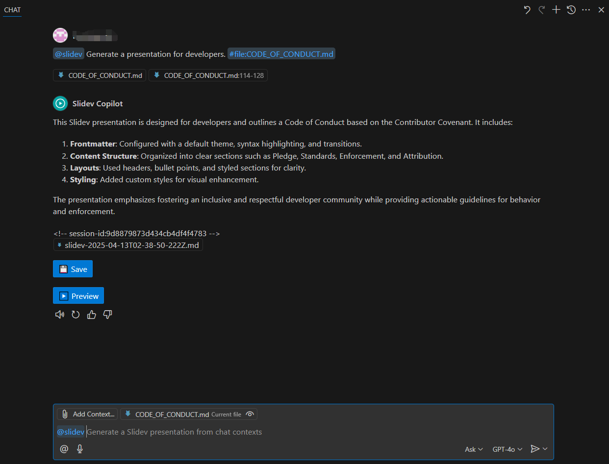

# Slidev Copilot for VS Code

<!--  -->

A Visual Studio Code extension that uses AI to generate [Slidev](https://sli.dev/) presentations directly from your chat context.

## Features

- 🎭 **Chat Integration**: Interact with Slidev Copilot directly in VS Code's chat interface
- 🚀 **Context-Aware**: Generates presentations based on chat context and requirements
- 📝 **Slidev Syntax**: Creates properly formatted Slidev markdown presentations
- 💾 **Easy Saving**: Save generated presentations with a single click
- 🖼️ **Preview Support**: Get a markdown preview before saving

## Requirements

- Visual Studio Code 1.80.0 or higher
- GitHub Copilot Chat installed and enabled
- [Slidev](https://sli.dev/) installed for presentation rendering

## Installation

1. Launch VS Code
2. Go to Extensions view (Ctrl+Shift+X)
3. Search for "Slidev Copilot"
4. Click Install

## Usage

1. Open VS Code Chat (Ctrl+Shift+P > "Open Chat View")
2. Type `@slidev` followed by your presentation requirements
3. Wait for the AI to generate your Slidev presentation
4. Click the "Save" button to save the markdown file
5. Use [Slidev](https://sli.dev/) to present your slides

## Contributing

Contributions are welcome! If you have suggestions or improvements, please open an issue or submit a pull request.

## License

This extension is licensed under the [MIT License](LICENSE).

---

**Enjoy creating beautiful Slidev presentations with AI assistance!**